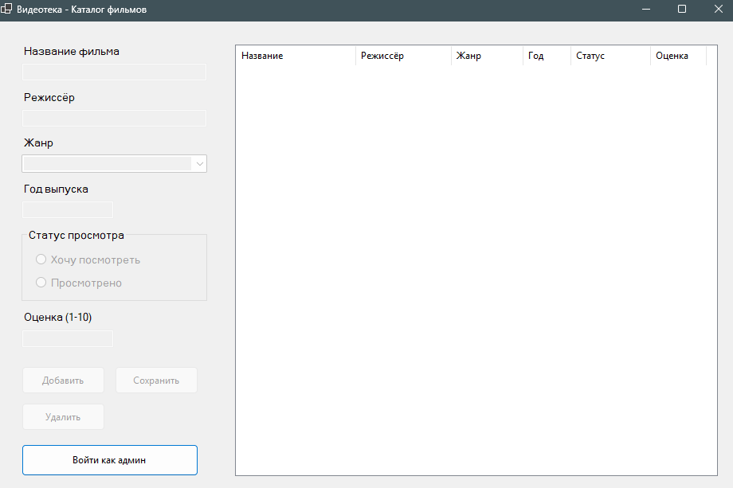

<body>

<h1>Видеотека — Каталог фильмов</h1>

Десктопное приложение на Windows Forms для учёта просмотренных и запланированных к просмотру фильмов.

<h2>Скриншот программы</h2>

<h2>Функционал</h2>

<ul>
    <li>Просмотр каталога фильмов в виде таблицы</li>
    <li>Добавление новых фильмов (название, режиссёр, жанр, год, статус, оценка)</li>
    <li>Редактирование существующих записей</li>
    <li>Удаление фильмов из каталога</li>
    <li>Разделение прав: обычные пользователи только просматривают, администратор управляет данными</li>
    <li>Защита админ-панели паролем (хранится в зашифрованном виде — SHA256)</li>
    <li>Сохранение и загрузка данных из XML-файла</li>
</ul>

<h2>Используемые элементы формы</h2>

<ul>
    <li><b>Label</b> — подписи к полям ввода</li>
    <li><b>TextBox</b> — ввод названия, режиссёра, года, оценки</li>
    <li><b>ComboBox</b> — выбор жанра фильма</li>
    <li><b>RadioButton</b> — выбор статуса просмотра</li>
    <li><b>ListView</b> — таблица с каталогом фильмов</li>
    <li><b>Button</b> — кнопки действий (добавить, сохранить, удалить, войти как админ)</li>
    <li><b>GroupBox</b> — группировка радиокнопок</li>
</ul>

<h2>Технологии</h2>

<ul>
    <li>C#</li>
    <li>Windows Forms (.NET Framework)</li>
    <li>XML-сериализация для хранения данных</li>
    <li>SHA256 для хеширования пароля</li>
</ul>

<h2>Как запустить</h2>

<ol>
    <li>Откройте проект <code>VideoLibrary.sln</code> в Visual Studio</li>
    <li>Нажмите <b>F5</b> или кнопку <b>«Запустить»</b></li>
    <li>При первом запуске автоматически создастся файл пароля (<code>admin_pwd.dat</code>)</li>
    <li>Пароль администратора по умолчанию: <code>admin123</code></li>
</ol>

<h2>Структура проекта</h2>

<pre>
VideoLibrary/
├── Form1.cs              — главная форма приложения
├── Form1.Designer.cs     — дизайнер главной формы
├── PasswordForm.cs       — форма ввода пароля
├── PasswordForm.Designer.cs
├── Movie.cs              — класс фильма (модель данных)
├── PasswordManager.cs    — работа с паролем (хеширование SHA256)
├── XmlManager.cs         — сохранение и загрузка XML
├── Program.cs            — точка входа
└── README.html           — этот файл
</pre>

<h2>Формат хранения данных</h2>

Данные фильмов сохраняются в файл <code>movies.xml</code> в корне проекта. Пароль хранится в файле <code>admin_pwd.dat</code> в виде SHA256-хеша.

</body>
</html>
